---
Simon Leclere
2026
---

# TP terraform & kubernetes - Partie 1

Dans cette première partie, on va utiliser les scripts et la configuration fournie pour déployer un cluster Kubernetes sur Proxmox via Terraform et Ansible.

Rappel des termes :
- **Proxmox VE** : hyperviseur de virtualisation utilisé pour héberger les machines virtuelles.
- **Template** : image VM préconfigurée utilisée pour cloner des VMs identiques.
- **Terraform** : outil d'IaC utilisé pour créer les VMs et les ressources dans Proxmox via un provider.
- **Ansible** : outil d'orchestration pour configurer les nodes (installation de containerd, kubeadm, kubelet, kubectl, etc.).
- **Kubernetes**: orchestrateur de conteneurs pour déployer et gérer des applications conteneurisées.
- **kubeadm / kubelet / kubectl** : composants Kubernetes pour initialiser et gérer le cluster.

## Etape 1: Création du template de VM

Avant de commencer le TP, on a déjà une installation proxmox fonctionnelle, avec un accès root via SSH configuré, un stockage NFS monté et deux bridges vmbr0 et vmbr1.

Dans un premier temps, on commence par préparer l'image de base, qui sera plus tard clonée par terraform pour créer les machines. Cela permet de partir d'une image propre et reproductible, avec les paquets et l'agent cloud-init correctement configurés.

Pour ça, on exécute le script `k8s-proxmox-iac/scripts/create_vm_template.sh`, qui prépare et convertit une VM Ubuntu Noble 24.04 LTS en template pour Proxmox VE (installation des paquets utiles, configuration SSH, nettoyage des logs et des identifiants uniques). Le template sert ensuite de source pour cloner les machines lors du déploiement Terraform.

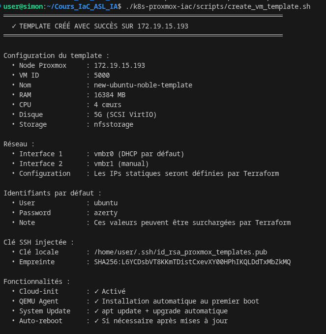

## Etape 2: Déploiement Terraform

La configuration Terraform se trouve dans `k8s-proxmox-iac/terraform` :
- `providers.tf` contient la configuration du provider Proxmox,
- `variables.tf` et `terraform.tfvars` définissent le nombre de nodes, ressources et adresses réseau,
- un module `modules/k8s-node` permet de factoriser la création des VMs.

Avant de le provisionning terraform, quelques changements sont quand même nécessaires. Notamment dans `terraform.tfvars` pour adapter les paramètres réseau à notre environnement Proxmox. Aussi, on change de version pour le provider Proxmox dans `providers.tf` pour éviter des problèmes de compatibilité.

On applique la configuration avec les commandes suivantes:
```bash
terraform init # initialise le backend et télécharge les plugins
terraform plan # affiche le plan d'exécution
terraform apply # applique la configuration et crée les ressources
```

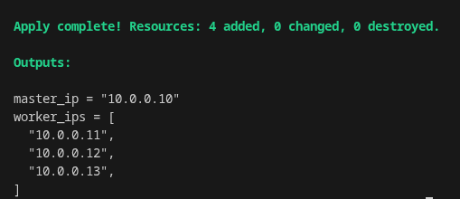

Après `apply`, Terraform retourne des outputs (IP des machines, IDs, etc.) utilisables pour l'inventaire Ansible.

On peut également voir les VMs créées dans l'interface Proxmox :
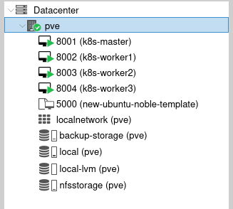

## Etape 3: Configuration via Ansible

Maintenant qu'on a l'infrastructure de base (les VMs) créée par Terraform, on utilise Ansible pour configurer les nodes et installer Kubernetes. Pour ca, on dispose de 4 playbooks dans `k8s-proxmox-iac/ansible/playbooks`, qui seront exécutés dans l'ordre.

Avant de les exécuter, on s'assure que notre machine locale peut se connecter aux VMs via SSH en utilisant la clé privée générée par le script de création de template (située dans `k8s-proxmox-iac/scripts/id_rsa_proxmox_templates`). Si besoin, on crée un tunnel SSH pour accéder aux VMs si elles ne sont pas directement accessibles.

### `01-prepare-nodes.yml` : préparation des nodes (utilisateurs, SSH, dépendances système)

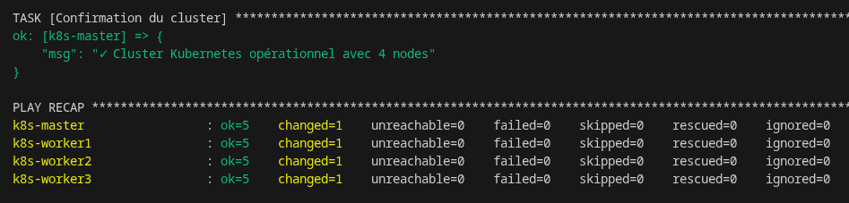

### `02-install-k8s.yml` : installation de `containerd`, `kubeadm`, `kubelet`, `kubectl` et verrouillage des versions

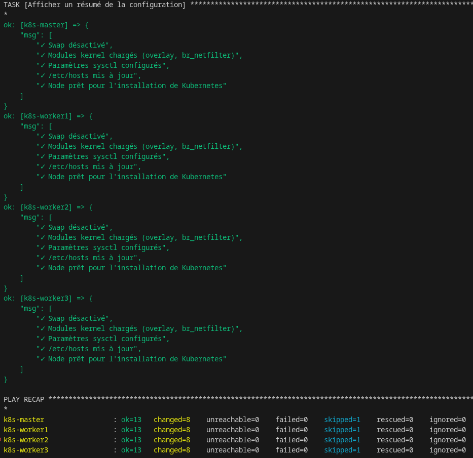

### `03-init-master.yml` : initialisation du master avec `kubeadm init`, configuration de `~/.kube/config`, installation du réseau Pod (ici Flannel via `kube-flannel.yml`) et génération de la commande de join qui est enregistrée dans `/tmp/k8s_join_command.sh`,

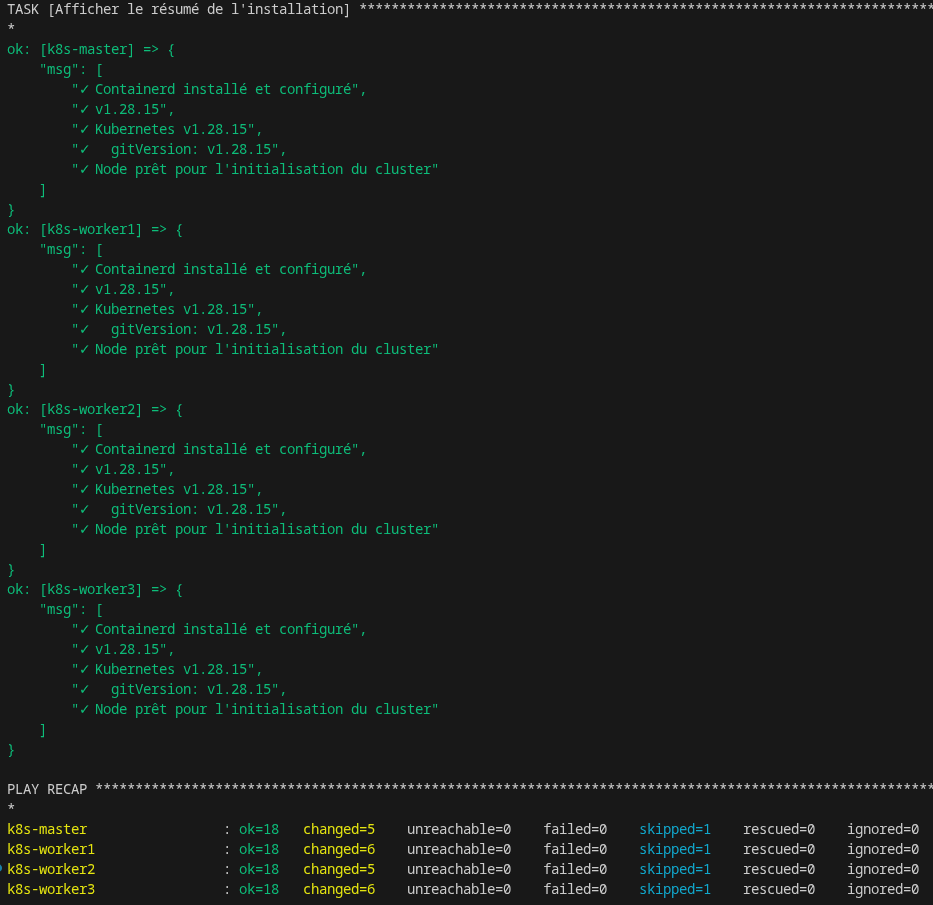

### `04-join-workers.yml` : exécution de la commande de jonction sur les workers pour les ajouter au cluster.

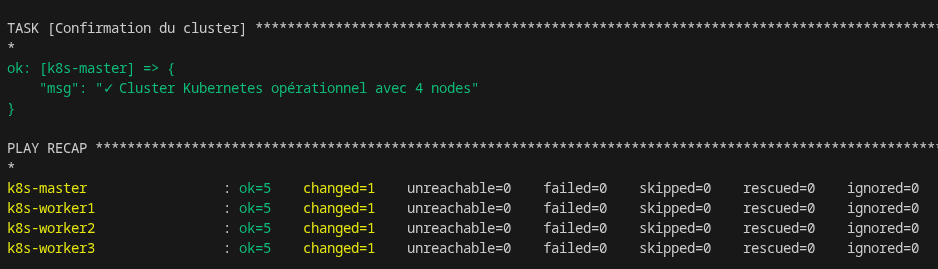

## Etape 4: Vérifications et conclusion

Après l'exécution des playbooks, on devrait normalement avoir un cluster Kubernetes fonctionnel avec un master et 3 workers. Pour vérifier l'état du cluster, on peut se connecter au master et exécuter quelques commandes :
- `kubectl get nodes` -> vérifier que tous les nodes apparaissent en `Ready`
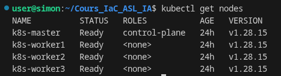

- `kubectl get pods -A` -> vérifier que les pods du plan de contrôle et du CNI (Flannel) sont en `Running`

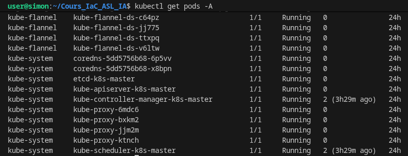

Pour la suite du TP, on simplifiera les commandes en copiant le fichier kubeconfig du master vers notre poste local, ce qui nous permettra d'utiliser `kubectl` directement depuis notre machine.

# Partie 2 : Exercices

On dispose d'un dossier `Exercises` contenant plusieurs exercices pratiques pour se familiariser avec Kubernetes : services, volumes persistants, ConfigMaps, déploiement d'une application PHP connectée à MariaDB, etc.

Pour certains, quelques questions de réflexion sont posées dans les fichiers README.md.

## Exercice 01 — Déployer une application de test sur Kubernetes

Objectif : Déployer une application simple (`nginx`) sur un cluster Kubernetes afin de vérifier le bon fonctionnement du cluster, du réseau et des services.

On crée un déploiement NGINX avec 3 réplicas, on expose le déploiement via un Service de type NodePort, puis on teste l'accès à l'application.

```bash
# On crée un déploiement nginx avec 3 replicas
kubectl create deployment nginx --image=nginx --replicas=3

# On vérifie que les pods ont bien été créés
kubectl get pods

# On expose le déploiement via un NodePort
kubectl expose deployment nginx --port=80 --type=NodePort

# On récupère les informations du service (port NodePort attribué)
kubectl get svc nginx

# Enfin, on teste l'accès à l'application depuis l'extérieur du cluster
curl http://10.0.0.11:31711
```

On peut voir les pods nginx en état Running et le service exposé en NodePort:


Si on ouvre l'url, on voit bien la page d'accueil NGINX s'afficher:
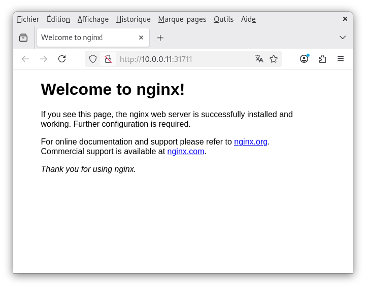

### Questions:

- Sur quels nœuds les pods nginx sont-ils déployés ?
> Les pods nginx sont déployés sur les nœuds workers du cluster Kubernetes. On peut vérifier cela en utilisant la commande `kubectl get pods -o wide`, qui affiche le nœud sur lequel chaque pod est hébergé.

- Que se passe-t-il si vous supprimez un pod nginx ?
> Si un pod nginx est supprimé, Kubernetes détecte que le nombre de réplicas spécifié dans le déploiement n'est plus respecté. En conséquence, il crée automatiquement un nouveau pod pour remplacer celui qui a été supprimé, assurant ainsi que le nombre de réplicas reste constant à 3.

- Quelle est la différence entre un Service ClusterIP et NodePort ?
> Un Service ClusterIP est le type de service par défaut dans Kubernetes. Il expose le service uniquement à l'intérieur du cluster, permettant aux pods de communiquer entre eux via une adresse IP interne. En revanche, un Service NodePort expose le service sur un port spécifique de chaque nœud du cluster, permettant l'accès au service depuis l'extérieur du cluster en utilisant l'adresse IP du nœud et le port NodePort attribué.

## Exercice 02 — Mise à l’échelle (Scaling) d’une application

Objectif : Apprendre à mettre à l’échelle un déploiement Kubernetes en modifiant le nombre de réplicas d’une application, et observer comment le cluster réagit automatiquement.

Contexte : Dans l’exercice précédent, on a déployé un déploiement `nginx` avec 3 réplicas.

L’objectif maintenant est de :
- Augmenter le nombre de pods pour gérer plus de trafic
- Réduire le nombre de pods si nécessaire
- Observer la réaction du cluster

On voit sur le screenshot ci-dessous l'augmentation automatique du nombre de pods de 3 à 5 par la commande `kubectl scale`.
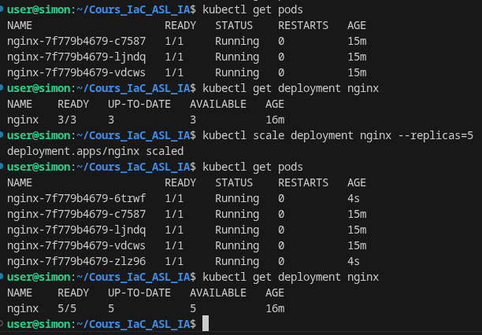

Enfin, on supprime un pod au hasard pour observer que Kubernetes recrée automatiquement un nouveau pod pour maintenir le nombre de réplicas défini:

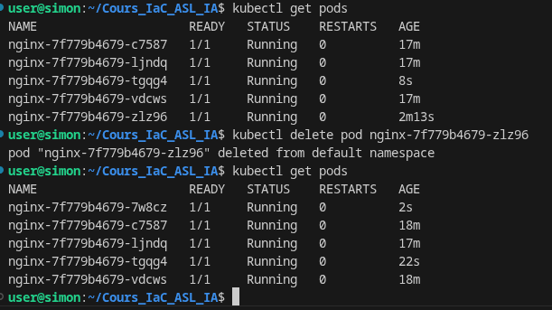

## Exercice 03 — Services Kubernetes et accès réseau

Objectif : Comprendre comment Kubernetes expose une application à l’intérieur et à l’extérieur du cluster en utilisant différents types de Services (`ClusterIP`, `NodePort`).

Maintenant que l'application NGINX est déployée, on va créer un Service de type ClusterIP pour l'accès interne, puis un Service de type NodePort pour l'accès externe.

1. Création d’un Service ClusterIP (interne) :
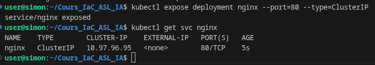

On remarque que le Service ClusterIP n’a pas d’EXTERNAL-IP, car il est uniquement accessible à l’intérieur du cluster.

On peut également tester l’accès interne depuis un pod en créant un pod temporaire avec l’image alpine et en utilisant curl (ou wget) pour accéder au service NGINX via son nom DNS.

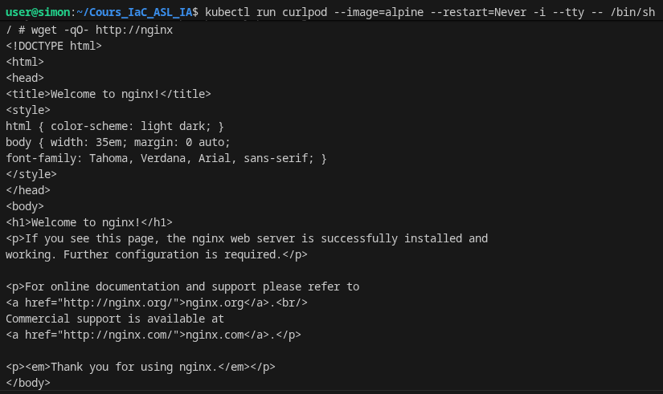

2. Création d’un Service NodePort (externe) :
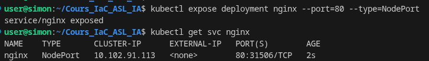

On remarque que le Service NodePort attribue un port externe (ici 31078) qui permet d’accéder à l’application depuis l’extérieur du cluster. Par exemple, firefox sur la machine hôte avec l’IP du nœud et le port NodePort.


## Exercice 04 — ConfigMaps & Secrets

Objectif : Apprendre à gérer la configuration et les secrets dans Kubernetes afin que les applications restent découplées de leur configuration et que les informations sensibles soient protégées.

Pour stocker des informations (configuration, mots de passe, clés API) dans kubernetes, il existe deux objets principaux :
- ConfigMap : pour les informations non sensibles
- Secret : pour les informations sensibles

Dans cet exercice, on va tester les deux options pour stocker un message de bienvenue pour NGINX (ConfigMap) et un mot de passe (Secret).

1. Création d’un ConfigMap

Création du ConfigMap avec un message de bienvenue :
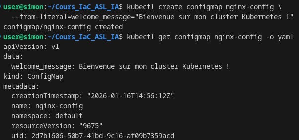

Ensuite, on crée un pod qui utilise le ConfigMap pour injecter la variable d’environnement WELCOME_MESSAGE :
```yaml
apiVersion: v1
kind: Pod
metadata:
  name: nginx-config-test
spec:
  containers:
  - name: nginx
    image: nginx
    env:
    - name: WELCOME_MESSAGE
      valueFrom:
        configMapKeyRef:
          name: nginx-config
          key: welcome_message
```

Puis on déploie le pod et on vérifie que la variable d’environnement est bien définie :
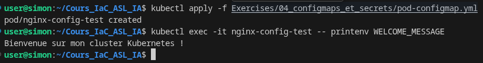

2. Création d’un Secret

Création du Secret avec un mot de passe encodé en base64 :
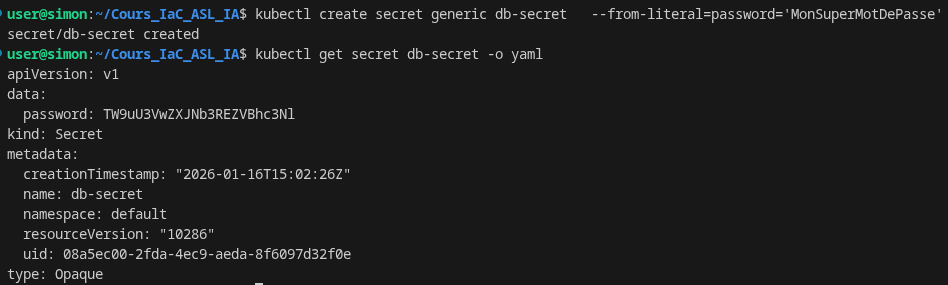

Ensuite, on crée un pod qui utilise le Secret pour injecter la variable d’environnement DB_PASSWORD :
```yaml
apiVersion: v1
kind: Pod
metadata:
  name: nginx-secret-test
spec:
  containers:
  - name: nginx
    image: nginx
    env:
    - name: DB_PASSWORD
      valueFrom:
        secretKeyRef:
          name: db-secret
          key: password
```

Puis on déploie le pod et on vérifie que la variable d’environnement est bien définie :
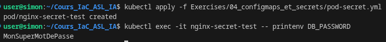

## Exercice 05 — Rolling Update

Objectif : Apprendre à mettre à jour un déploiement Kubernetes sans interruption grâce aux rolling updates.

Les applications doivent souvent être mises à jour sans interrompre le service. Kubernetes permet de mettre à jour les images d’un Deployment progressivement, un pod après l’autre.

Dans cet exercice, on va mettre à jour l’image NGINX d’un déploiement existant vers une version plus récente, tout en assurant une disponibilité continue.

1. Vérification du déploiement existant
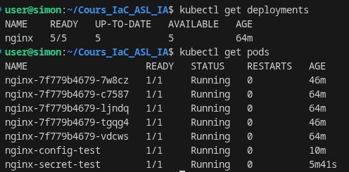

2. Mise à jour de l’image du déploiement et suivi de la mise à jour
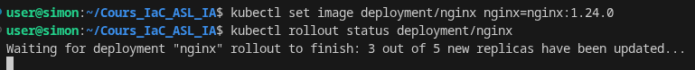

3. Rollback vers l'ancienne version
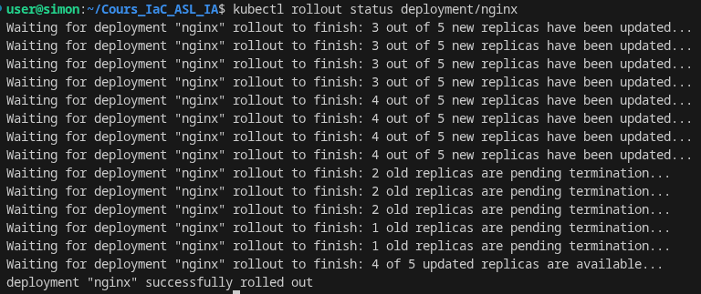

On peut voir que les pods sont mis à jour progressivement, sans interruption de service. Kubernetes gère automatiquement le remplacement des pods et on peut revenir en arrière avec `rollout undo` si nécessaire.

## Exercice 06 — Ingress

Objectif : Comprendre comment exposer plusieurs services Kubernetes via un point d’entrée unique avec Ingress.

NodePort permet d’exposer un service par port, mais si on a plusieurs services, c’est compliqué. Ingress permet de router le trafic HTTP/S vers différents services en fonction de l’URL ou du nom d’hôte.

Dans cet exercice, on va installer un contrôleur Ingress (NGINX), puis créer un Ingress pour router le trafic vers un service NGINX. Enfin, on vérifiera que les requêtes HTTP sont correctement routées par Ingress.

1. Installation du contrôleur Ingress (NGINX)

On déploie les ressources nécessaires pour Ingress NGINX
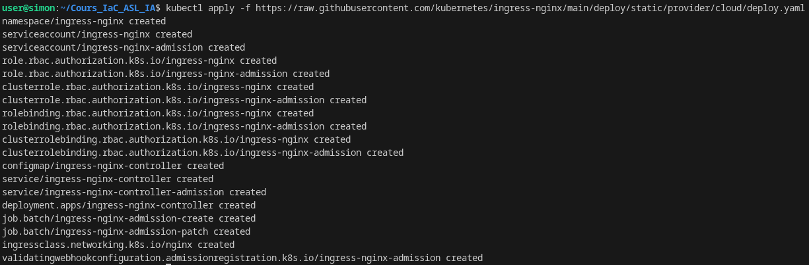

Puis on vérifie que tout s'est bien créé
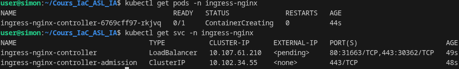

2. Création d’un Ingress pour le service NGINX

On crée le contrôleur Ingress NGINX :
```yaml
apiVersion: networking.k8s.io/v1
kind: Ingress
metadata:
  name: example-ingress
spec:
  ingressClassName: nginx
  rules:
  - host: example.local
    http:
      paths:
      - path: /
        pathType: Prefix
        backend:
          service:
            name: nginx
            port:
              number: 80
```

Puis on applique le manifest et on vérifie que l’Ingress est créé :
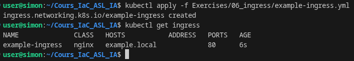

3. Vérification du routage via Ingress

Pour tester le routage, on ajoute une entrée dans le fichier `/etc/hosts` de notre machine locale pour faire pointer `example.local` vers l’IP du nœud (récupérée via `kubectl get nodes -o wide`).

Ensuite, on effectue une requête HTTP vers `example.local` :
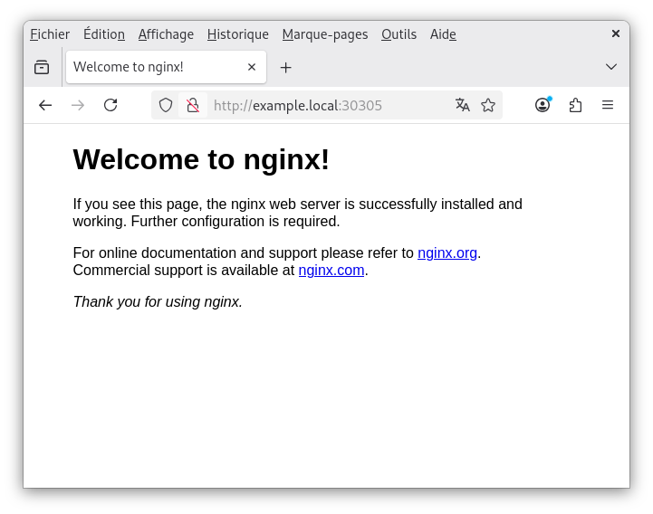

On peut voir que la requête est bien routée vers le service NGINX via Ingress.

## Exercice 07 — Scaling & Déploiement avec Deployment

Objectif : Créer un deployment à partir d’un fichier YAML, comprendre le lien entre Deployment → ReplicaSet → Pods, et gérer le scaling.

Un Deployment permet de déclarer l’état désiré d’une application (nombre de replicas, image, labels, etc.). Kubernetes s’occupe de créer et maintenir les pods correspondants. Les labels et le selector permettent de relier le Deployment aux pods qu’il gère.

Dans cet exercice, on va créer un Deployment NGINX avec 3 réplicas, puis exposer le déploiement via un Service NodePort, et enfin gérer le scaling en augmentant et diminuant le nombre de pods.

1. Création du deployment

On commence par créer un fichier web-deployment.yaml contenant :
```yaml
apiVersion: apps/v1
kind: Deployment
metadata:
  name: web-deployment
spec:
  replicas: 3
  selector:
    matchLabels:
      app: nginx-logiciel # Le lien entre le deployment et les pods
  template:
    metadata:
      labels:
        app: nginx-logiciel # L'étiquette collée sur chaque clone
    spec:
      containers:
      - name: nginx
        image: nginx
        ports:
        - containerPort: 80
```

Puis on le déploie et on vérifie que les pods sont créés :
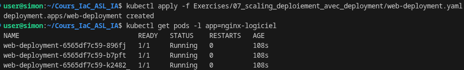

2. Exposition du deployment via NodePort

On expose le déploiement via un Service NodePort et on vérifie le service créé :
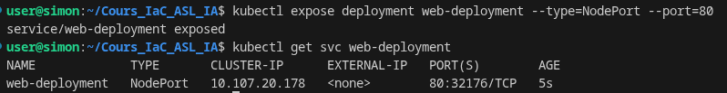

On teste l’accès à l’application :
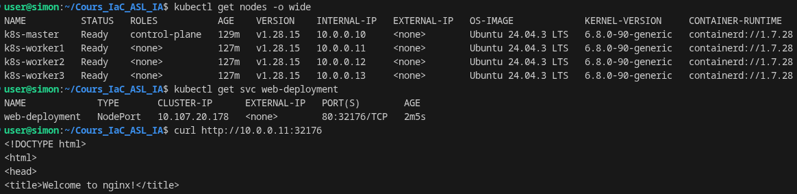

3. Gestion du scaling

On augmente le nombre de pods à 5 :
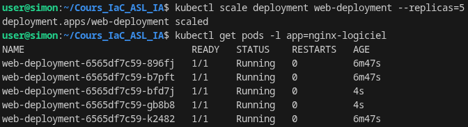

On diminue le nombre de pods à 2 :
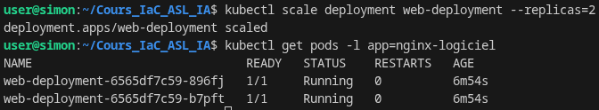

On peut voir que Kubernetes ajuste automatiquement le nombre de pods en fonction du nombre de réplicas spécifié dans le Deployment.

## Exercice 08 — Service interne ClusterIP

Objectif: Apprendre à exposer un Deployment uniquement à l’intérieur du cluster avec un service de type ClusterIP, et vérifier que les pods du Deployment sont bien accessibles via ce service.

Dans cet exercice, on va créer un service interne pour que les pods puissent communiquer entre eux ou avec d’autres pods sans exposer le service à l’extérieur.

1. Création du Service ClusterIP

On commence par créer un fichier web-service.yaml avec le contenu suivant :
```yaml
apiVersion: v1
kind: Service
metadata:
  name: web-service-unique
spec:
  selector:
    app: nginx-logiciel # Il cherche les pods avec ce label (ceux de notre Deployment !)
  ports:
    - protocol: TCP
      port: 80          # Le port du Service
      targetPort: 80    # Le port du Pod
  type: ClusterIP       # IP interne uniquement
```

Puis on déploie le service et on vérifie qu’il est créé :
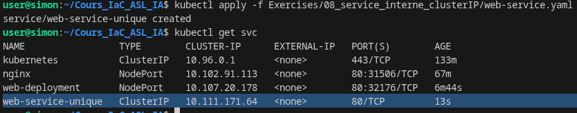

2. Test de la connectivité interne

On crée un pod temporaire pour tester l’accès au service :
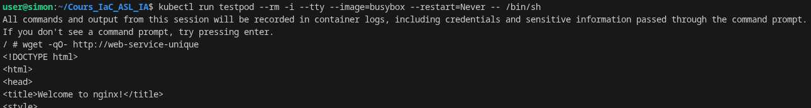

On voit bien la page d’accueil de NGINX, ce qui confirme que le service ClusterIP fonctionne correctement.

3. Vérification des endpoints

On liste les endpoints du service pour vérifier qu’ils correspondent aux pods du Deployment :
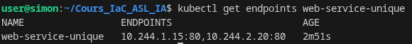

On peut voir que les IPs des pods du Deployment sont bien listées comme endpoints du service. Cela confirme que le service ClusterIP est correctement lié aux pods.

## Exercice 09 — Déploiement avec ConfigMap comme volume

Objectif : Apprendre à utiliser une ConfigMap pour stocker du contenu (ici une page HTML) et le monter dans un pod en tant que volume, afin que NGINX puisse servir ce contenu.

Dans cet exercice, on va créer une ConfigMap contenant une page HTML personnalisée, puis on va créer un Deployment NGINX qui monte cette ConfigMap en tant que volume. Ainsi, NGINX servira la page HTML définie dans la ConfigMap.

1. Création de la ConfigMap

On crée un fichier index.html avec le contenu suivant :
```html
<h1>Bienvenue sur mon NGINX version ConfigMap !</h1>
<p>Ce contenu est servi directement depuis une ConfigMap.</p>
```

Puis on crée la ConfigMap à partir de ce fichier :
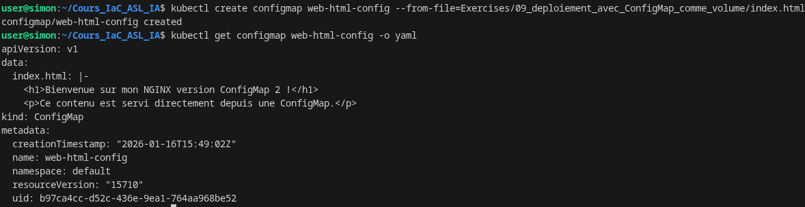

2. Création du Deployment avec montage de la ConfigMap

On crée un fichier web-deployment-configmap.yaml avec le contenu suivant :
```yaml
apiVersion: apps/v1
kind: Deployment
metadata:
  name: web-deployment
spec:
  replicas: 3
  selector:
    matchLabels:
      app: nginx-logiciel
  template:
    metadata:
      labels:
        app: nginx-logiciel
    spec:
      containers:
      - name: nginx
        image: nginx
        ports:
        - containerPort: 80
        volumeMounts:
        - name: html-storage
          mountPath: /usr/share/nginx/html/  # Nginx lira notre ConfigMap ici
      volumes:
      - name: html-storage
        configMap:
          name: web-html-config # Le nom de la ConfigMap créée à l'étape A
```

Puis on applique le déploiement et on vérifie que les pods sont créés et que le deployment est accessible:
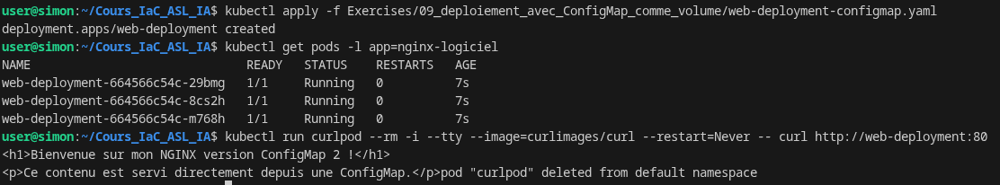

3. Mise à jour de la ConfigMap

On modifie le fichier index.html pour changer le message de bienvenue, on met à jour la ConfigMap, puis on redémarre les pods pour qu’ils prennent en compte la nouvelle version de la ConfigMap.:
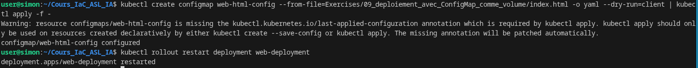

Enfin, on vérifie que la nouvelle page est bien servie par NGINX :
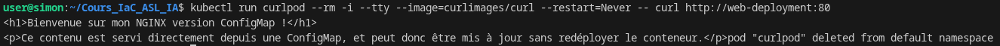

On peut voir que NGINX sert bien le contenu mis à jour depuis la ConfigMap, démontrant ainsi comment utiliser une ConfigMap comme volume dans un pod Kubernetes.

## Exercice 10 — Déployer MariaDB avec volume persistant

Objectif : Apprendre à déployer une base de données MariaDB sur Kubernetes en utilisant un PersistentVolume (PV) et un PersistentVolumeClaim (PVC) pour le stockage persistant des données.

Dans cet exercice, on va créer un PV utilisant un hostPath pour le stockage local sur le nœud, un PVC pour réclamer ce stockage, puis déployer MariaDB en utilisant ce PVC pour stocker ses données. L'objectif est de s'assurer que les données de la base persistent même si le pod MariaDB est redémarré ou recréé.

1. Création du secret pour les identifiants MariaDB

MariaDB nécessite un mot de passe pour l'utilisateur root. On va créer un secret Kubernetes pour stocker ce mot de passe de manière sécurisée.
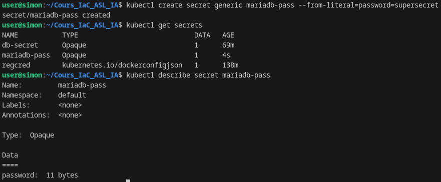

2. Création du PersistentVolume (PV)

Le PV définit la capacité de stockage et le chemin sur le nœud où les données seront stockées. On crée un fichier mariadb-pv.yaml avec le contenu suivant :
```yaml
apiVersion: v1
kind: PersistentVolume
metadata:
  name: mariadb-pv
spec:
  capacity:
    storage: 1Gi
  accessModes:
    - ReadWriteOnce
  hostPath:
    path: "/mnt/data-mariadb"
```

Puis on applique le PV et on vérifie qu’il est créé :
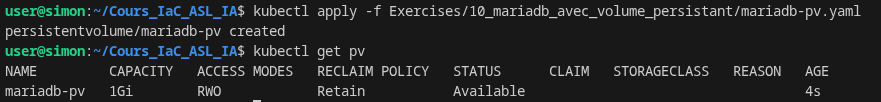

Avec ce PV, les données de MariaDB seront stockées localement sur le nœud dans le répertoire `/mnt/data-mariadb`. Ce type de volume est pédagogique, mais pas recommandé en production car il ne supporte pas la haute disponibilité ni la portabilité des données entre nœuds. De plus, comme le deployment force l'exécution sur k8s-worker1, le répertoire `/mnt/data-mariadb` doit être créé manuellement sur ce nœud avant le déploiement.
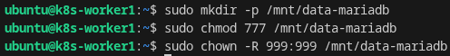

3. Création du PersistentVolumeClaim (PVC)

Le PVC permet de réclamer une partie du stockage défini par le PV. On crée un fichier mariadb-pvc.yaml avec le contenu suivant :
```yaml
apiVersion: v1
kind: PersistentVolumeClaim
metadata:
  name: mariadb-pvc
spec:
  accessModes:
    - ReadWriteOnce
  resources:
    requests:
      storage: 1Gi
```

Puis on applique le PVC et on vérifie qu’il est créé :
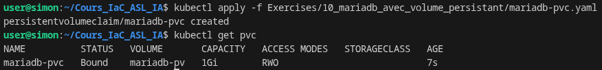

4. Déploiement de MariaDB

Maintenant qu’on a le PV et le PVC, on peut déployer MariaDB en utilisant le PVC pour le stockage des données. On crée un fichier mariadb-deploy.yaml avec le contenu suivant :
```yaml
apiVersion: apps/v1
kind: Deployment
metadata:
  name: mariadb
spec:
  replicas: 1
  selector:
    matchLabels:
      app: mariadb
  template:
    metadata:
      labels:
        app: mariadb
    spec:
      nodeSelector:
        kubernetes.io/hostname: k8s-worker1
      containers:
      - name: mariadb
        image: mariadb:10.6
        env:
        - name: MARIADB_ROOT_PASSWORD
          valueFrom:
            secretKeyRef:
              name: mariadb-pass
              key: password
        - name: MARIADB_DATABASE
          value: mabase
        ports:
        - containerPort: 3306
        volumeMounts:
        - name: storage
          mountPath: /var/lib/mysql
      volumes:
      - name: storage
        persistentVolumeClaim:
          claimName: mariadb-pvc
---
apiVersion: v1
kind: Service
metadata:
  name: mariadb-service
spec:
  selector:
    app: mariadb
  ports:
    - port: 3306
      targetPort: 3306
```

Puis on applique le déploiement et on vérifie que le pod MariaDB est créé et en cours d’exécution :
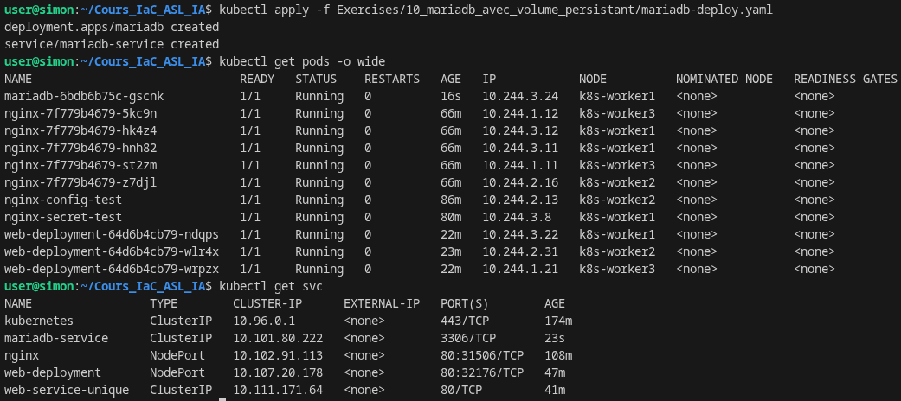

5. Test de connectivité à MariaDB

On crée un pod temporaire pour tester la connexion à MariaDB :
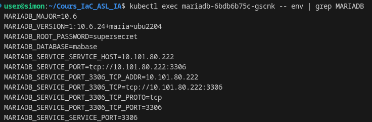

6. Vérification de la persistance des données

Enfin, on va vérifier que les données persistent même après le redémarrage du pod MariaDB.

On commence par créer une base de données et une table et on insère des données :
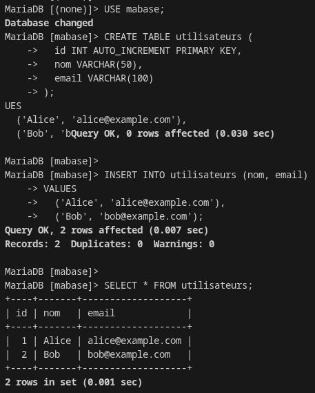

Ensuite, on supprime le pod MariaDB pour simuler un redémarrage et on vérifie que le pod est recréé automatiquement par le deployment :
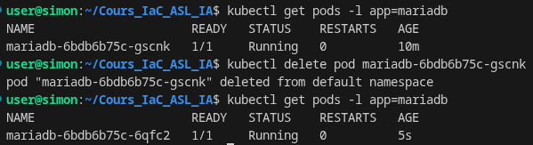

Après le redémarrage, on se reconnecte à MariaDB et on vérifie que les données insérées précédemment sont toujours présentes :
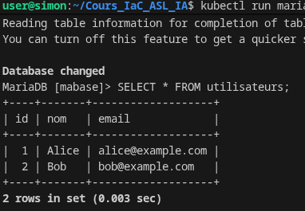

On peut voir que les données insérées avant le redémarrage du pod sont toujours présentes, ce qui confirme que le stockage persistant via le PersistentVolume et le PersistentVolumeClaim fonctionne correctement avec MariaDB sur Kubernetes.

## Exercice 11 — Déployer une application PHP connectée à MariaDB

Objectif : Déployer une application PHP simple sur Kubernetes qui se connecte à une base de données MariaDB, en utilisant des ConfigMaps et des Secrets pour la configuration.

Dans cet exercice, on va créer une ConfigMap pour le code PHP, un Secret pour le mot de passe de la base de données, puis déployer une application PHP qui se connecte à MariaDB.

On suppose que MariaDB est déjà déployée et accessible via le service `mariadb-service`.

1. Création de la ConfigMap pour le code PHP

On crée un fichier index.php avec le contenu suivant :
```php
apiVersion: v1
kind: ConfigMap
metadata:
  name: php-code
data:
  index.php: |
    <?php
    $host = 'mariadb-service';
    $db   = 'mabase';
    $user = 'root';
    $pass = getenv('DB_PASSWORD'); // 🔐 Mot de passe depuis le Secret

    try {
        $dsn = "mysql:host=$host;dbname=$db;charset=utf8mb4";
        $pdo = new PDO($dsn, $user, $pass);

        echo "<body style='font-family:sans-serif; text-align:center; padding-top:50px; background-color:#f0fff4;'>";
        echo "<h1 style='color:#2f855a;'>✅ Connexion Réussie !</h1>";
        echo "<p>PHP communique correctement avec MariaDB.</p>";
        echo "<p><b>Service DB :</b> $host</p>";
        echo "<p><b>IP Pod PHP :</b> " . $_SERVER['SERVER_ADDR'] . "</p>";
        echo "</body>";
    } catch (PDOException $e) {
        echo "<body style='font-family:sans-serif; text-align:center; padding-top:50px; background-color:#fff5f5;'>";
        echo "<h1 style='color:#c53030;'>❌ Erreur de Connexion</h1>";
        echo "<p>" . $e->getMessage() . "</p>";
        echo "</body>";
    }
    ?>
---
apiVersion: apps/v1
kind: Deployment
metadata:
  name: php-app
spec:
  replicas: 2
  selector:
    matchLabels:
      app: php-web
  template:
    metadata:
      labels:
        app: php-web
    spec:
      containers:
      - name: php
        image: php:8.0-apache
        command: ["sh", "-c", "docker-php-ext-install pdo pdo_mysql && apache2-foreground"]
        ports:
        - containerPort: 80
        env:
        - name: DB_PASSWORD
          valueFrom:
            secretKeyRef:
              name: mariadb-pass
              key: password
        volumeMounts:
        - name: code-volume
          mountPath: /var/www/html/index.php
          subPath: index.php
      volumes:
      - name: code-volume
        configMap:
          name: php-code
---
apiVersion: v1
kind: Service
metadata:
  name: php-service
spec:
  type: ClusterIP
  selector:
    app: php-web
  ports:
    - port: 80
      targetPort: 80
```

Puis on applique la ConfigMap :
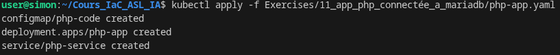

2. Vérification de la ConfigMap

Et on vérifie qu’elle est créée :
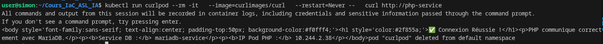

On voit sur le screenshot ci-dessus que la ConfigMap contient bien le code PHP.

### Activité 1: Compréhension de l'architecture

A partir des manifestes fournis, on va analyser l'architecture de l'application PHP connectée à MariaDB, et identifier les différents composants et leur rôle. On réalisera également un schéma simple de l'architecture.


On utilise quelques commandes basiques pour explorer les ressources créées :
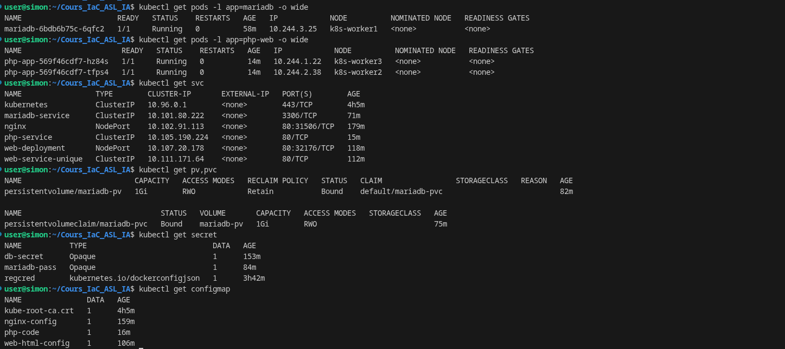

On en déduit:
- **Le pod MariaDB :** `mariadb-6bdb6b75c-6qfc2` (IP: `10.244.3.25`, **Node :** `k8s-worker1`)
- **Les pods PHP :** `php-app-569f46cdf7-hz84s` (IP: `10.244.1.22`, **node** `k8s-worker3`) et `php-app-569f46cdf7-tfps4` (IP: `10.244.2.38`, **node** `k8s-worker2`)
- **Les services :**
  - `mariadb-service` — **ClusterIP** `10.101.80.222` (port 3306) → point d’accès DB interne.
  - `php-service` — **ClusterIP** `10.105.190.224` (port 80) → service interne pour l’app PHP.
  - `nginx` — **NodePort** `10.102.91.113` (80:31506) → exposé sur les nœuds.
  - `web-deployment` — **NodePort** `10.107.20.178` (80:32176).
  - `web-service-unique` — **ClusterIP** `10.111.171.64` (port 80).
- **Les volumes utilisés :**
  - PersistentVolume **`mariadb-pv`** (1Go) — **lié** à PersistentVolumeClaim **`mariadb-pvc`**. Ce stockage permet la persistance des données MariaDB.
- **Les Secrets & ConfigMaps :**
  - **Secrets :** `mariadb-pass` (contient la clé `password` utilisée par MariaDB), `db-secret`, `regcred` (docker registry cred).
  - **ConfigMaps :** `php-code` (contient `index.php` monté dans les pods PHP), `nginx-config`, `web-html-config`, `kube-root-ca.crt`.

Différence entre Service et Pod:
- Un **Pod** est l'unité de base de déploiement dans Kubernetes, représentant un ou plusieurs conteneurs qui partagent le même réseau et stockage.
- Un **Service** est une abstraction qui définit un ensemble logique de pods et une politique d'accès à ces pods, permettant la découverte et la communication entre eux.

Différence entre ConfigMap et Secret:
- Une **ConfigMap** est utilisée pour stocker des données de configuration non sensibles sous forme de paires clé-valeur.
- Un **Secret** est utilisé pour stocker des informations sensibles, telles que des mots de passe ou des clés API, de manière sécurisée.

### Activité 2: Vérification de la connexion réseau

Depuis un Pod PHP (`php-app`), on vérifie la résolution DNS et la connectivité vers le service `mariadb-service` : le nom se résout correctement et la connexion MySQL est fonctionnelle.

On utilise `mariadb-service` plutôt qu'une IP parce que le Service fournit un point d'accès stable (DNS + IP virtuelle) et effectue du load‑balancing vers les pods backend ; les IP des pods sont éphémères et peuvent changer lors des redéploiements ou déplacements des pods.

### Activité 3: Création manuelle de données

On crée une table posts et on ajoute quelques entrées manuellement via le pod mariadb.

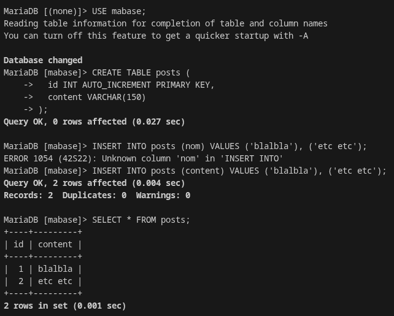

### Activité 4: Test de la persistance des données

On va supprimer le pod MariaDB pour simuler un redémarrage, puis vérifier que les données insérées précédemment sont toujours présentes.

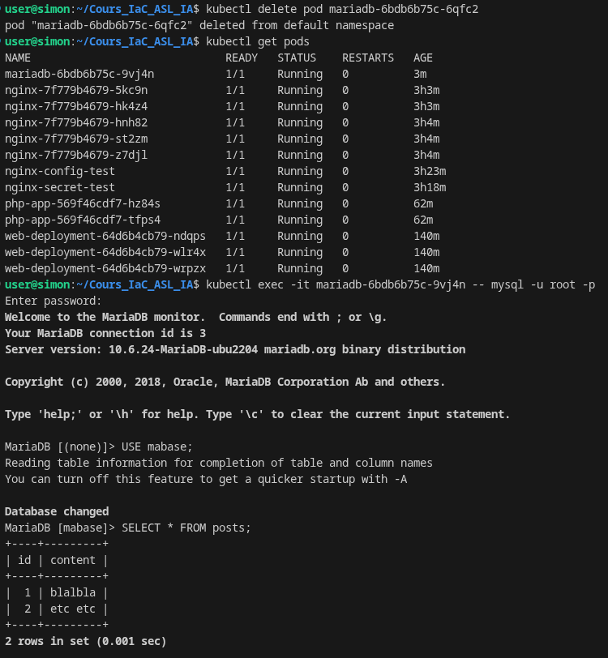

On voit sur le screenshot que les données insérées avant le redémarrage du pod sont toujours présentes, ce qui confirme que le stockage persistant via le PersistentVolume et le PersistentVolumeClaim fonctionne correctement avec MariaDB sur Kubernetes.

Le volume persistant permet de conserver les données même si le pod est supprimé ou redémarré, assurant ainsi la durabilité des données de la base MariaDB.

### Activité 5: Modifier le code PHP via ConfigMap

Nombre d'utilisateurs dans la table:
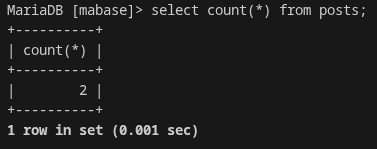

On met maintenant à jour la ConfigMap `php-app` pour modifier le code PHP.

On applique la nouvelle ConfigMap et on redémarre les pods PHP pour qu’ils prennent en compte la nouvelle version du code :

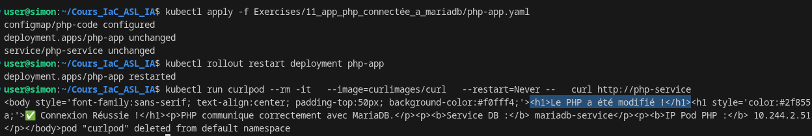

### Activité 6: Simulation de panne applicative

On va simuler une panne de l’application PHP en supprimant un pod PHP, puis vérifier que Kubernetes recrée automatiquement un nouveau pod pour maintenir le nombre de réplicas défini dans le Deployment.

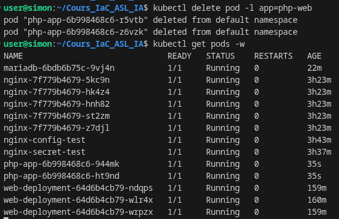

Les réplicas sont bien maintenus à 2, et le nouveau pod recréé fonctionne correctement.

Les réplicas assurent la haute disponibilité de l’application en maintenant un nombre constant de pods en cours d’exécution. Si un pod échoue ou est supprimé, Kubernetes crée automatiquement un nouveau pod pour remplacer celui qui a été perdu, garantissant ainsi que l’application reste disponible et fonctionnelle.

### Activité 7: Débogage kubernetes

### Activité 7 – Débogage Kubernetes (bonus ⭐)

Dans cette activité, on va volontairement introduire des erreurs dans la configuration de l’application PHP connectée à MariaDB, puis utiliser les outils de diagnostic Kubernetes pour identifier et comprendre les problèmes.

#### 1. Erreur : mauvais nom de service

On modifie la ConfigMap contenant le code PHP pour utiliser un nom de service inexistant (par exemple `mariadb-service-faux` au lieu de `mariadb-service`). Après avoir redémarré les pods PHP, l’application ne parvient plus à se connecter à la base de données.

Pour diagnostiquer l’erreur :
```bash
kubectl logs <nom-du-pod-php>
```
On observe un message d’erreur indiquant l’impossibilité de résoudre le nom DNS ou d’établir la connexion à la base.

On peut également utiliser :
```bash
kubectl describe pod <nom-du-pod-php>
```
pour vérifier les événements récents et les éventuelles erreurs de démarrage.

#### 2. Erreur : mauvais mot de passe DB

On modifie le Secret `mariadb-pass` pour y mettre un mot de passe incorrect, puis on redémarre les pods PHP. L’application échoue à se connecter à MariaDB.

Diagnostic :
```bash
kubectl logs <nom-du-pod-php>
```
affiche une erreur d’authentification MySQL (ex : `Access denied for user 'root'@'...'`).

#### Questions de réflexion

- **Pourquoi ne pas mettre le mot de passe DB dans le code PHP ?**
  
  Mettre le mot de passe en dur dans le code PHP expose un risque de sécurité : toute personne ayant accès au code source peut lire le mot de passe. Utiliser un Secret Kubernetes permet de séparer les informations sensibles du code et de limiter leur exposition.

- **Quelle différence entre redémarrer un Pod et redéployer une application ?**
  
  Redémarrer un Pod (par exemple en le supprimant) entraîne la recréation d’un pod identique par le Deployment, sans modification de la configuration ou de l’image. Redéployer une application (par exemple après modification du manifest ou de l’image) met à jour la configuration, l’image ou les variables d’environnement, et peut entraîner la création de nouveaux pods avec ces changements.

- **Que se passe-t-il si le nœud Kubernetes tombe ?**
  
  Si un nœud tombe, tous les pods qui y étaient hébergés deviennent indisponibles. Kubernetes détecte l’indisponibilité du nœud et recrée automatiquement les pods sur les autres nœuds disponibles (si les ressources le permettent), assurant ainsi la haute disponibilité de l’application.
